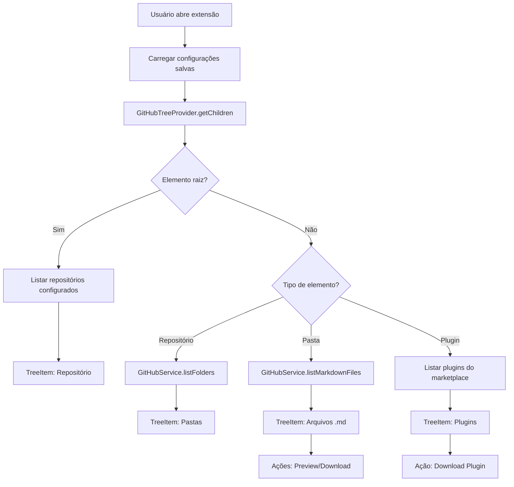

# Plano de Desenvolvimento - Extensão VS Code GitHub Markdown Viewer

## Arquitetura Geral

A extensão seguirá a estrutura padrão de extensões VS Code com TypeScript:

```
extensao-cortex/
├── src/
│   ├── extension.ts              # Ponto de entrada da extensão
│   ├── providers/
│   │   └── GitHubTreeProvider.ts # TreeDataProvider principal
│   ├── models/
│   │   ├── Repository.ts        # Modelo de repositório
│   │   ├── Marketplace.ts       # Modelo de marketplace
│   │   └── Config.ts             # Modelo de configurações
│   ├── services/
│   │   ├── GitHubService.ts      # Serviço para API do GitHub
│   │   ├── ConfigService.ts      # Gerenciamento de configurações
│   │   └── FileService.ts        # Download e manipulação de arquivos
│   ├── commands/
│   │   └── index.ts              # Registro de comandos
│   └── utils/
│       └── marketplaceParser.ts  # Parser para marketplace.yml/yaml/json
├── package.json                  # Manifesto da extensão
├── tsconfig.json                 # Configuração TypeScript
├── .vscodeignore
└── README.md
```

## Fluxo de Dados



## Implementação Detalhada

### 1. Estrutura Base do Projeto

**Arquivos a criar:**

- `package.json` - Manifesto com contribuições (commands, views, configuration)
- `tsconfig.json` - Configuração TypeScript
- `.vscodeignore` - Arquivos a ignorar no pacote
- `src/extension.ts` - Ativação da extensão

**Configurações no package.json:**

- Tree View ID: `githubMarkdownViewer`
- Commands para configuração (repositório, pasta, diretório download, token)
- Configurações padrão (settings)
- Ícones para Tree View

### 2. Sistema de Configurações (`src/services/ConfigService.ts`)

**Funcionalidades:**

- Salvar/carregar configurações usando `vscode.workspace.getConfiguration()`
- Configurações padrão:
  - `repositories`: Array de objetos `{owner, repo, token?, basePath?}`
  - `defaultBasePath`: `"eng"` (pasta padrão)
  - `defaultDownloadPath`: `"./downloads"` (diretório padrão)
- Persistência em workspace settings ou global settings

**Estrutura de dados:**

```typescript
interface RepositoryConfig {
  owner: string;
  repo: string;
  token?: string;
  basePath?: string;
  downloadPath?: string;
}
```

### 3. Serviço GitHub (`src/services/GitHubService.ts`)

**Dependência:** `@octokit/rest` para API do GitHub

**Métodos principais:**

- `listRepositories()`: Retorna repositórios configurados
- `listFolders(owner, repo, path, token?)`: Lista pastas em um diretório
- `listMarkdownFiles(owner, repo, path, token?)`: Lista arquivos .md
- `getFileContent(owner, repo, path, token?)`: Obtém conteúdo de arquivo
- `getMarketplaceFile(owner, repo, token?)`: Busca marketplace.yml/yaml/json
- `downloadFiles(owner, repo, sourcePath, targetPath, token?)`: Download recursivo

**Tratamento de erros:**

- Repositórios privados sem token
- Arquivos não encontrados
- Rate limiting da API

### 4. Tree Data Provider (`src/providers/GitHubTreeProvider.ts`)

**Implementação de `vscode.TreeDataProvider<TreeItem>`:**

**Hierarquia da Tree View:**

1. **Raiz**: Lista de repositórios configurados
2. **Repositório**: Mostra pastas da basePath (ex: `/eng`)
3. **Pasta**: Mostra arquivos .md ou subpastas
4. **Arquivo .md**: Item com ações de preview/download
5. **Plugin**: Item especial quando marketplace existe

**TreeItem customizado:**

```typescript
class GitHubTreeItem extends vscode.TreeItem {
  constructor(
    public readonly label: string,
    public readonly collapsibleState: vscode.TreeItemCollapsibleState,
    public readonly type: 'repository' | 'folder' | 'file' | 'plugin',
    public readonly data?: any // Dados específicos (path, owner, repo, etc)
  ) {
    super(label, collapsibleState);
  }
  
  // Ícones baseados no tipo
  // Command actions para preview/download
}
```

**Métodos principais:**

- `getChildren(element?)`: Retorna filhos baseado no tipo do elemento
- `getTreeItem(element)`: Retorna TreeItem formatado
- `refresh()`: Atualiza a view

### 5. Parser de Marketplace (`src/utils/marketplaceParser.ts`)

**Funcionalidades:**

- Suporta `.yml`, `.yaml` e `.json`
- Usa `js-yaml` para YAML e `JSON.parse` para JSON
- Valida estrutura esperada
- Extrai lista de plugins

**Estrutura esperada:**

- Campo `plugins` como array
- Cada plugin com `name`, `source`, etc.

### 6. Comandos VS Code (`src/commands/index.ts`)

**Commands a registrar:**

1. **`githubMarkdownViewer.configureRepository`**

   - Input box para owner/repo
   - Opcional: token para privado
   - Salva em configurações

2. **`githubMarkdownViewer.configureBasePath`**

   - Input box para caminho base (ex: "eng")
   - Aplica ao repositório atual ou padrão

3. **`githubMarkdownViewer.configureDownloadPath`**

   - Input box ou file picker para diretório
   - Salva configuração padrão ou por repositório

4. **`githubMarkdownViewer.configureToken`**

   - Input box com password mask
   - Salva token criptografado ou em secure storage

5. **`githubMarkdownViewer.previewFile`**

   - Abre arquivo .md em preview pane
   - Usa `vscode.workspace.openTextDocument` e `vscode.window.showTextDocument`

6. **`githubMarkdownViewer.downloadFile`**

   - Quick pick: workspace atual ou pasta específica
   - Download do arquivo via GitHubService

7. **`githubMarkdownViewer.downloadPlugin`**

   - Quick pick: workspace atual ou pasta específica
   - Download recursivo da pasta `source` do plugin

8. **`githubMarkdownViewer.refresh`**

   - Atualiza Tree View

### 7. Ações na Tree View (Hover Actions)

**Implementação:**

- Usar `TreeItem.command` ou `TreeItem.contextValue`
- Menu contextual com `contributes.menus.view/item/context`
- Ou usar `TreeItem.tooltip` com informações

**Ícones:**

- Eye icon para preview
- Download icon para download
- Folder icon para pastas
- File icon para arquivos

### 8. Preview de Arquivos Markdown

**Implementação:**

- Usar `vscode.workspace.openTextDocument` com `vscode.Uri.parse`
- Criar URI temporário ou usar `vscode.window.showTextDocument`
- Suportar preview nativo do VS Code para .md

### 9. Download de Arquivos

**Funcionalidades:**

- Download de arquivo único (.md)
- Download recursivo de pasta (plugins)
- Criar estrutura de diretórios localmente
- Verificar se arquivo já existe (perguntar substituir)

**Implementação:**

- Usar `fs` module do Node.js
- Criar diretórios com `fs.mkdirSync(recursive: true)`
- Escrever arquivos com `fs.writeFileSync`

## Dependências Principais

```json
{
  "dependencies": {
    "@octokit/rest": "^20.0.0",
    "js-yaml": "^4.1.0"
  },
  "devDependencies": {
    "@types/node": "^20.0.0",
    "@types/vscode": "^1.80.0",
    "@types/js-yaml": "^4.0.0",
    "typescript": "^5.0.0"
  }
}
```

## Ordem de Implementação

1. **Setup inicial**: package.json, tsconfig.json, estrutura de pastas
2. **ConfigService**: Sistema de configurações básico
3. **GitHubService**: Integração com API do GitHub (sem token primeiro)
4. **GitHubTreeProvider**: Tree View básica (apenas repositórios)
5. **Comandos de configuração**: Adicionar/remover repositórios
6. **Navegação completa**: Pastas e arquivos na Tree View
7. **Preview**: Visualização de arquivos .md
8. **Download**: Download de arquivos individuais
9. **Marketplace**: Parser e suporte a plugins
10. **Download de plugins**: Download recursivo
11. **Ações hover**: Ícones e ações na Tree View
12. **Tratamento de erros**: Validações e mensagens
13. **Testes e refinamentos**: Ajustes finais

## Considerações Importantes

- **Segurança**: Tokens devem ser armazenados usando `vscode.SecretStorage` ou similar
- **Performance**: Cache de resultados da API quando apropriado
- **Rate Limiting**: Implementar tratamento para limites da API GitHub
- **Compatibilidade**: Testar em VS Code, Cursor e Windsurf
- **Ícones**: Usar ícones do conjunto padrão do VS Code ou criar customizados
- **Error Handling**: Mensagens claras para usuário em caso de erro

## Pontos de Atenção

1. A Tree View deve ser atualizada quando configurações mudarem
2. Suportar múltiplos repositórios simultaneamente na mesma view
3. Marketplace pode estar em qualquer nível da árvore (verificar recursivamente?)
4. Download de plugins deve manter estrutura de diretórios
5. Preview deve funcionar mesmo sem workspace aberto